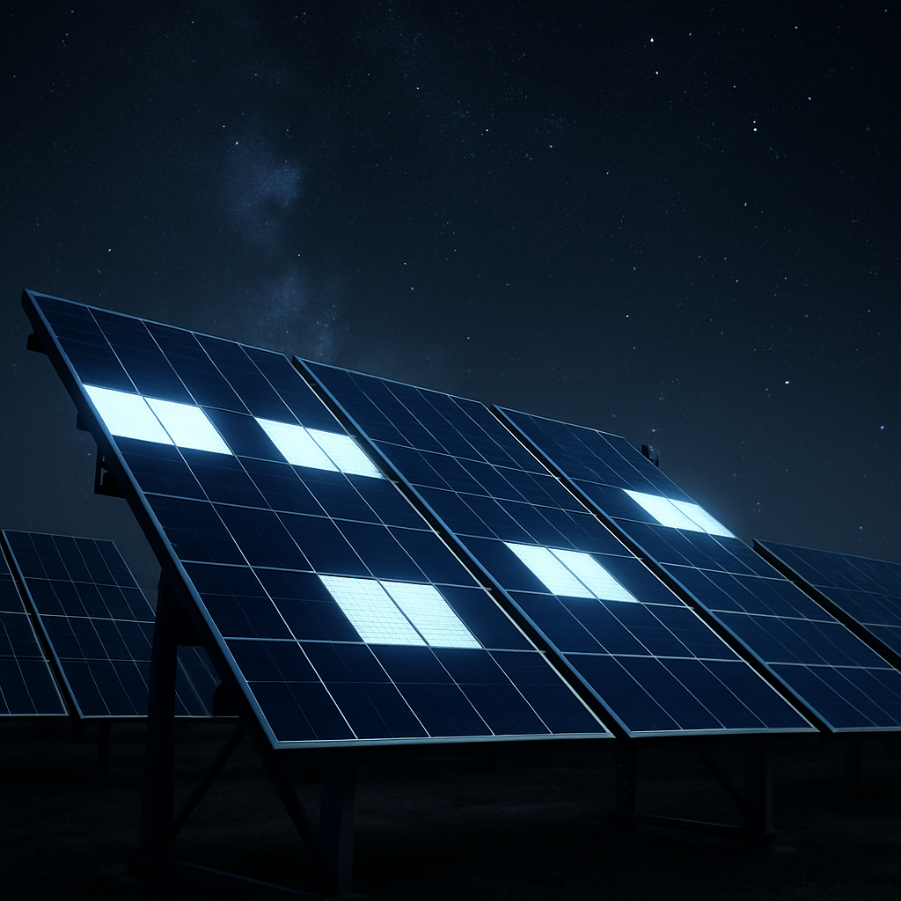

# Technická dokumentace: NoctiVolt – Solární panely s nočním výnosem

## Výrobce
**Heliosyn Energy Systems GmbH**

## Modelová řada
**NoctiVolt NVX-400**

---

## 🧪 Popis technologie

NoctiVolt využívá kombinaci klasické fotovoltaiky a pokročilého **termoradiativního efektu**.  
Během dne se panel chová jako standardní solární panel s výkonnými monokrystalickými články (účinnost až 23,4 %).  
V noci využívá rozdílu teplot mezi povrchem panelu a chladným nočním nebem (radiativní ochlazování), a pomocí speciální vrstvy z **grafenu a InSb (indium antimonidu)** generuje zpětný proud.

---

## ⚙️ Technické specifikace

| Parametr                 | Hodnota                             |
|--------------------------|-------------------------------------|
| Rozměry panelu           | 1800 x 1000 x 40 mm                 |
| Hmotnost                 | 22,5 kg                             |
| Výkon ve dne (STC)       | 400 Wp                              |
| Výkon v noci (typický)   | 50 – 75 W                           |
| Typ článků               | Monokrystalický + termoradiativní  |
| Noční účinnost           | až 8 %                              |
| Provozní teploty         | -30°C až +70°C                      |
| Záruka                   | 25 let výkonová, 15 let produktová |

---

## 🌙 Noční režim

- Aktivuje se automaticky při poklesu slunečního záření pod 50 W/m².
- Systém obsahuje termočlánky a řízený měnič, který optimalizuje výstup i při nízkém nočním výkonu.
- Ideální pro oblasti s velkým rozdílem denní a noční teploty, např. pouště nebo hory.

---

## 🧰 Instalace

- Stejná jako u běžných solárních panelů (MC4 konektory, standardní držáky).
- Doporučuje se použití s bateriovým uložištěm pro maximální využití noční produkce.

---

## 🧿 Bezpečnost a normy

- Certifikace: IEC 61215, IEC 61730, RoHS, CE  
- Termální stabilita vrstvy testována dle normy ASTM D 5338

---

## ✨ Vizuální efekt

Panely **svítí díky aktivní termoradiativní vrstvě**, která vyzařuje viditelné spektrum během chlazení – jde o přirozený důsledek luminiscenčního efektu během noční výroby energie.  
Záře je jemná a má modrobílý odstín, což signalizuje aktivní noční režim panelu.

---

